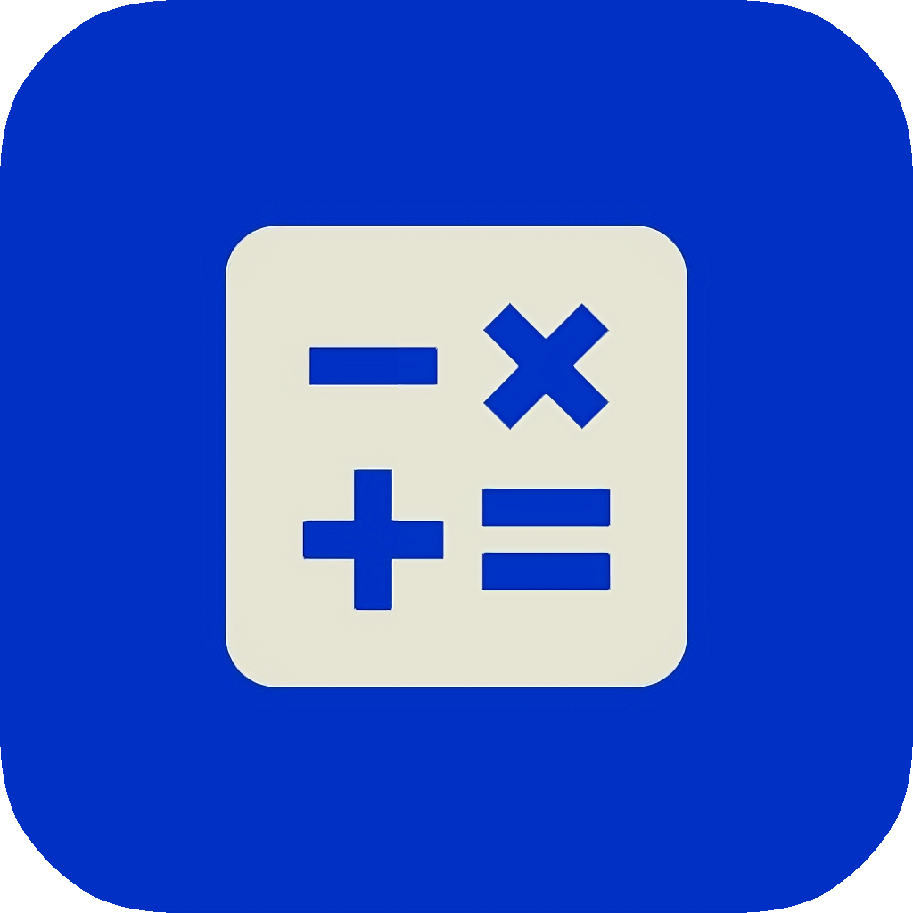
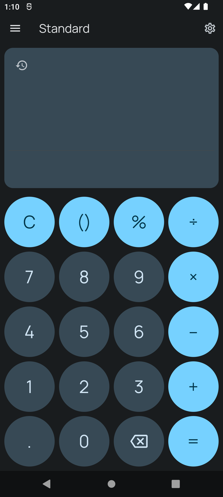
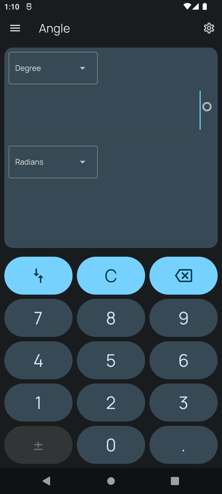
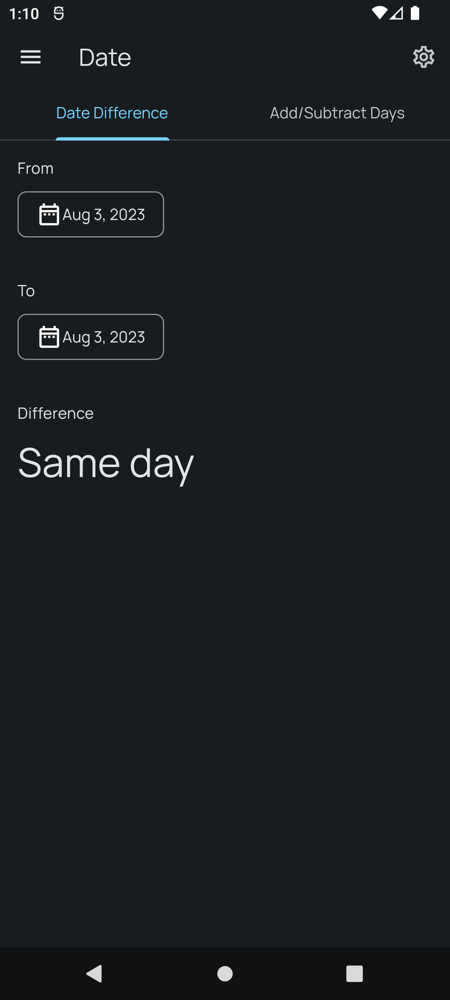

# LapisCalc

  

<h1 align="center">LapisCalc</h1>

**A simple, elegant, and ad-free calculator and unit converter app for Android**

## 📖 Overview

LapisCalc is a versatile Android application that combines the functionality of a complete calculator with an advanced unit converter. Designed with a modern interface inspired by Material Design 3, it offers a smooth and intuitive user experience, completely ad-free.

## 📥 Get LapisCalc

*Available now on Google Play Store - Free and Ad-free*

## 📱 Screenshots

| Standard Calculator | Unit Converter | Date Calculator |
|:------------------:|:--------------:|:---------------:|
|  |  |  |

## ✨ Key Features

### 🧮 Calculator
- **Standard Calculator**: Basic arithmetic operations (addition, subtraction, multiplication, division)
- **Date Calculator**: Calculate durations between dates, add/subtract days
- **Calculation History**: Keep track of previous operations (up to 100 calculations)

### 🔧 Unit Converter
- **Angle**: Degrees, radians, gradians
- **Area**: Square meters, hectares, acres, and more
- **Data**: Bytes, KB, MB, GB, TB, and binary units
- **Energy**: Joules, calories, kWh, BTU
- **Length**: Meters, kilometers, miles, feet, inches
- **Mass**: Kilograms, grams, pounds, ounces
- **Power**: Watts, horsepower, BTU/h
- **Pressure**: Pascals, bars, atmospheres, PSI
- **Temperature**: Celsius, Fahrenheit, Kelvin
- **Time**: Seconds, minutes, hours, days, years
- **Speed**: m/s, km/h, mph, knots
- **Volume**: Liters, gallons, cubic meters, cups
- **Tip Calculator**: Tip calculator with customizable percentages

### 🎨 Interface Features
- Material Design 3
- Automatic dark/light theme support
- Multi-language support (Italian, English, Spanish, French, Romanian)
- Responsive interface for different screen formats
- Custom Manrope font for better readability

## 💻 Technologies Used
- **Framework**: Flutter 3.0+
- **Language**: Dart
- **Design**: Material Design 3
- **State Management**: Provider
- **Localization**: Flutter Intl
- **Persistence**: SharedPreferences

## 📄 License and Original Project
LapisCalc is based on [**MintCalc**](https://github.com/boredcodebyk/mintcalc) by [boredcodebyk](https://github.com/boredcodebyk). 
This repository is an **independent project** with improvements and additional features, derived from the original MintCalc.

### License
This project is distributed under the **GNU General Public License v3.0**. See the [LICENSE](LICENSE) file for complete details.

## 📋 Current Version
**Version**: 1.1.8

To see recent changes, check the [CHANGELOG](CHANGELOG.md) in the metadata directory.

---

### 🔗 Useful Links
- [Google Play Page](https://play.google.com/store/apps/details?id=com.ilgalghi.lapiscalc)
- [Original MintCalc Repository](https://github.com/boredcodebyk/mintcalc)
- [GNU GPL v3.0 License](https://www.gnu.org/licenses/gpl-3.0.html)
